# Cloths and Cubes
A real-time physics engine with cloth simulation and an interactive 3D scene editor,
built in C# / OpenTK as a Bachelor's thesis project at the Warsaw University of
Technology, Faculty of Mathematics and Information Science (2025–2026).

> This is my fork of the team repository. See **[Authors](#authors)** for the
> contribution split &ndash; my work covered the visualization and interaction layer.

## Screenshots

### Highlights

    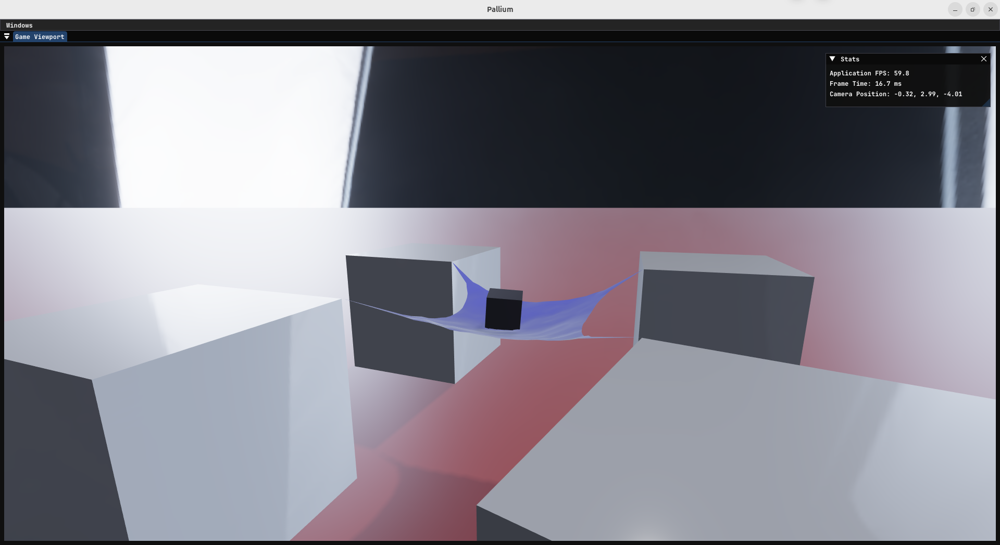
    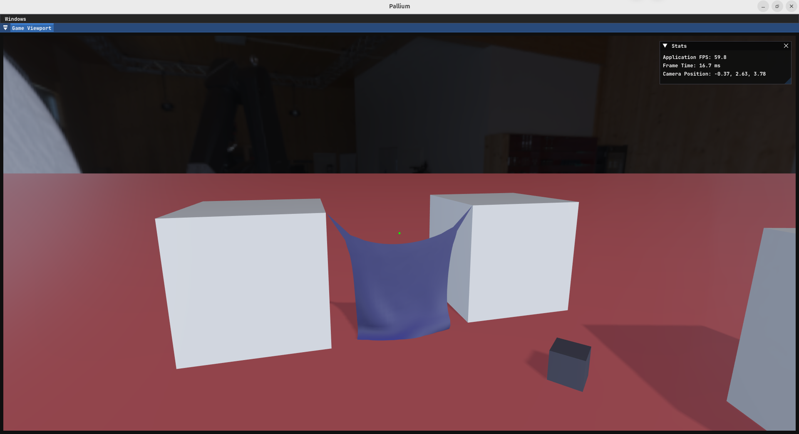
    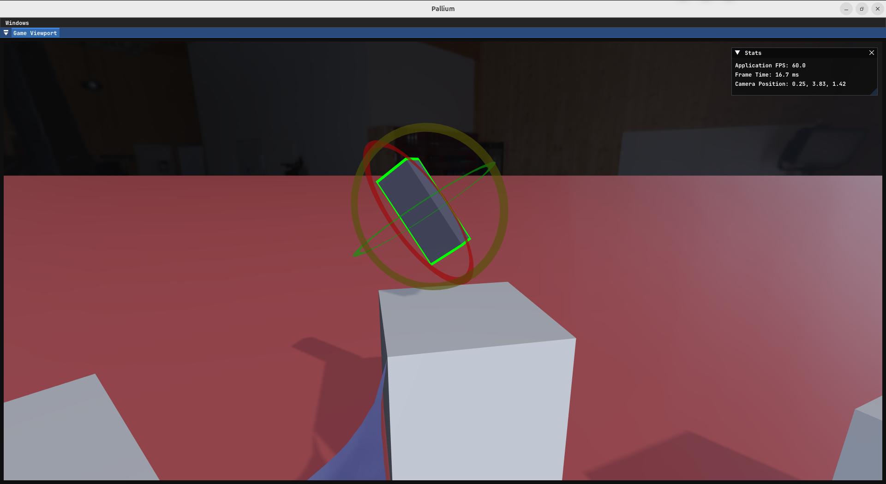

### Details

  
Cloth interacting with rigid bodies

    
    
    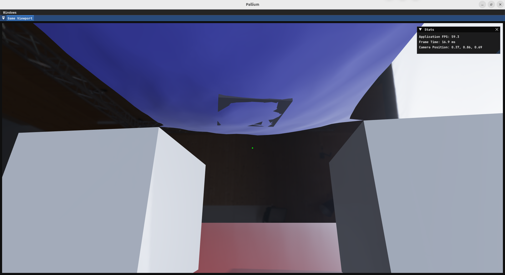

  
Highlight of the selected object

    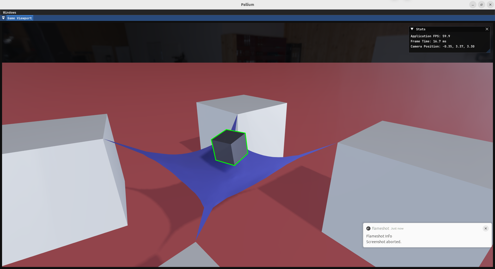
    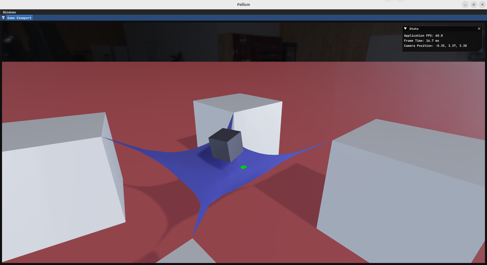
    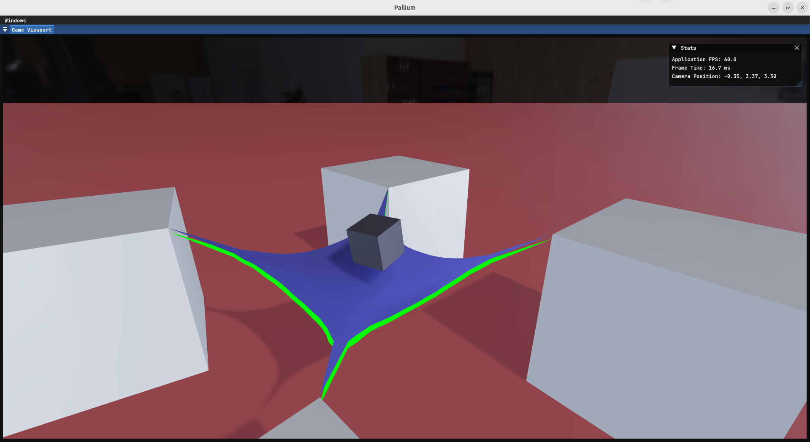
    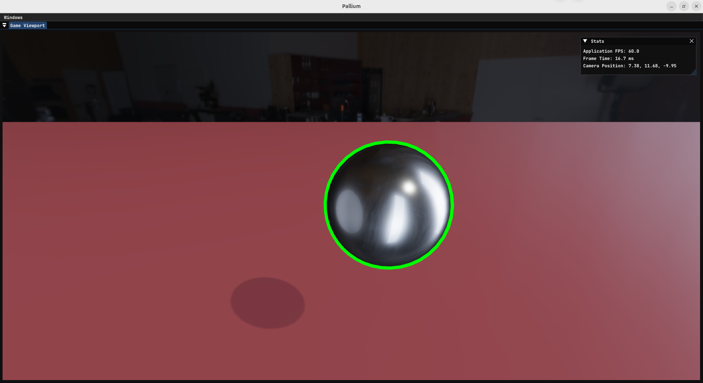

  
Highlight of the object that will be moved

    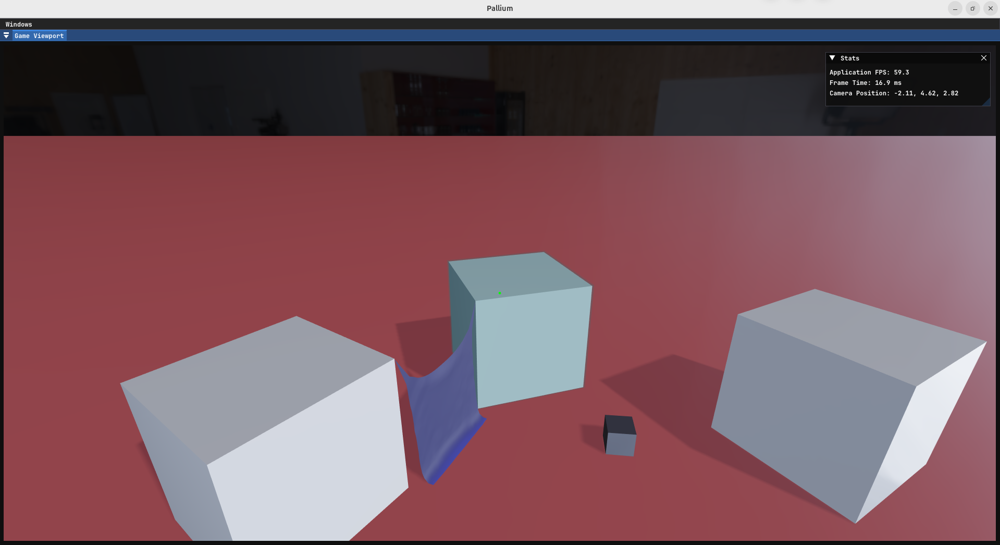
    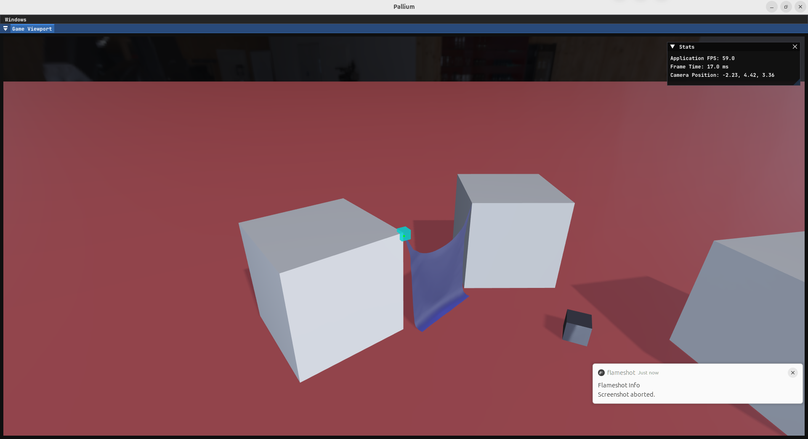
    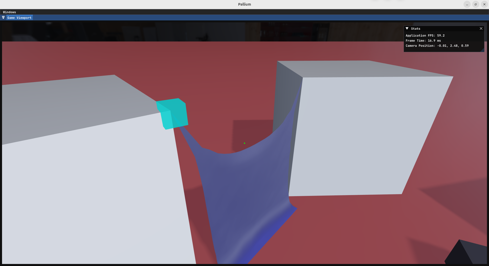
    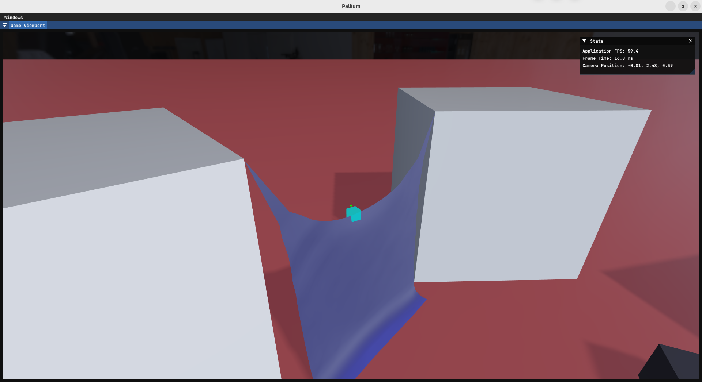

  
Transformation gizmos

    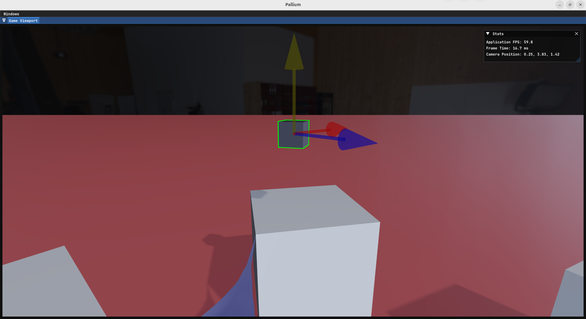
    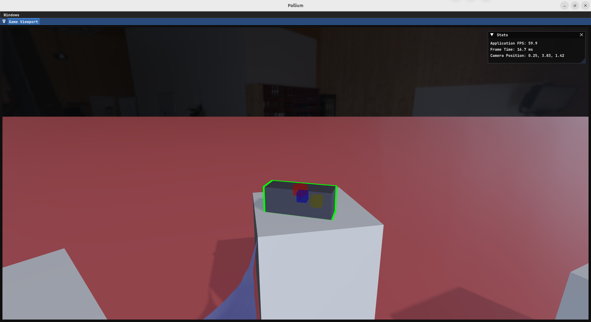
    

## Features
**Physics engine**
- Impulse-based rigid body dynamics for cuboids and spheres
- Cloth simulated as a mass–spring grid with temporal substepping for stability
- Broad-phase collision via BVH on axis-aligned bounding volumes, rebuilt every frame
- Narrow-phase resolution via a contact graph with Union–Find islands processed independently
- Runge–Kutta integration for object motion

**Interactive 3D editor**
- PBR rendering pipeline based on Epic's *Real Shading in Unreal Engine 4*
- Cascaded shadow maps
- Transformation gizmos &ndash; translate / rotate / scale via mouse
- Ray-cast object picking with visual highlighting
- Cloth-point pinning to cuboid corners (snap on proximity, release on distance)
- Scene save / load, runtime addition of cuboids, spheres, and cloths

## Tech stack
- C# / .NET 
- OpenTK (OpenGL bindings) 
- Dear ImGui 
- GLSL

## Authors
A 3-person Bachelor's thesis project. The table below covers code authorship; the
written thesis was a separate joint effort.

| Author | Main contribution |
|---|---|
| [1180779](https://github.com/1180779) *(this fork)* | Visualization & interaction layer - PBR rendering, cascaded shadow maps, transformation gizmos, ray-cast object picking with cloth-point pinning, scene save / load, ray-intersection unit tests |
| [lowStakesDilemma](https://github.com/lowStakesDilemma) | Physics engine foundation, impulse-based contact resolver, BVH broad-phase, contact graph rework for performance, engine unit tests |
| [Cam1lleFerros](https://github.com/Cam1lleFerros) | Cloth representation as a mass–spring grid, cloth display mesh, engine unit tests |

## References
- Ian Millington, *Game Physics Engine Development* &ndash; engine foundation
- Brian Karis, *Real Shading in Unreal Engine 4* &ndash; PBR shading model

## Build
Open `Engine.sln` in JetBrains Rider or Visual Studio 2022 (with the .NET
desktop workload), build the solution, and run the `Visualization.UiLayer`
project.

## License
Third-party dependency licenses are bundled under `Licenses/`.
